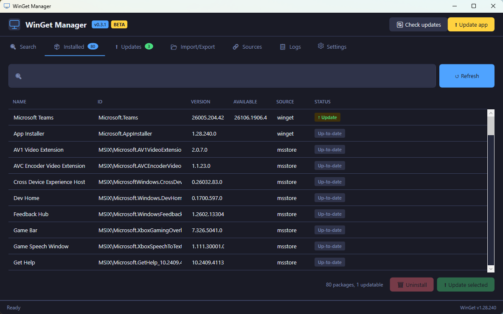

# WinGet Manager

Lightweight GUI for Windows Package Manager (`winget`) with dark/light theme and silent mode for automation. Written in PowerShell + WPF, compiled to a single `.exe` of ~225 KB.

[](https://github.com/Bolt-Connect/WinGet-Manager/releases/latest)

[](https://github.com/Bolt-Connect/WinGet-Manager/actions/workflows/build.yml)
[](https://github.com/Bolt-Connect/WinGet-Manager/releases)
[](LICENSE)


## ⬇ Download

| Type | Link | When to choose |
|---|---|---|
| **Portable** | [WinGetManager.exe](https://github.com/Bolt-Connect/WinGet-Manager/releases/latest/download/WinGetManager.exe) | Single-file, runs without install. USB, dev machine. |
| **Setup installer** | [WinGetManager-Setup.exe](https://github.com/Bolt-Connect/WinGet-Manager/releases/latest/download/WinGetManager-Setup.exe) | Clean install with Start menu, uninstaller, optional auto-update task. |
| **Portable bundle** | [WinGetManager-portable.zip](https://github.com/Bolt-Connect/WinGet-Manager/releases/latest/download/WinGetManager-portable.zip) | EXE + config + docs in one zip. For offline distribution. |

[All releases →](https://github.com/Bolt-Connect/WinGet-Manager/releases)

---

## 📸 Screenshot



*Dark mode, Installed tab — package list with status pills, source column (winget / msstore / local), and multi-select bulk actions.*

---

## Features

- **🔍 Search-as-you-type** — live results while typing, async, no UI freeze
- **📦 Manage installed packages** — versions + update status, multi-select for bulk actions
- **⬆ Update** — all or selected packages with live progress (`3/12: Firefox...`)
- **🔄 Auto-detect blocking apps** — close running apps that prevent updates
- **📂 Import / Export** — JSON backup compatible with `winget export/import`
- **🔗 Manage sources** — add, remove, reset winget sources
- **🌗 Theme** — Dark / Light / Auto (follows Windows system preference)
- **🌍 Multi-language** — English + Dutch with automatic detection (Settings → Language)
- **🤖 Silent mode** — all features headless via CLI for Task Scheduler
- **📋 Logging** — daily logs with rotation + live panel in GUI (always English for shareability)
- **⬆ Self-update** — checks GitHub for new versions, downloads + restarts
- **🔒 Security** — HTTPS-only to `*.github.com`, PE header check on downloads

## Requirements

- **Windows 10** (1809+) or **Windows 11**
- **WinGet** (App Installer) — ships by default with Windows 11. On Windows 10 [install via Microsoft Store](ms-windows-store://pdp/?productid=9NBLGGH4NNS1)

## Silent mode (automation)

All GUI features are also available via command line — suitable for scripts and Task Scheduler:

```powershell
# Update all packages silently
WinGetManager.exe -UpdateAll -Silent

# Install a specific package
WinGetManager.exe -Install Mozilla.Firefox

# Export installed packages
WinGetManager.exe -ExportPath "C:\backup\packages.json"

# List all available updates
WinGetManager.exe -ListUpdates

# Import on another machine
WinGetManager.exe -ImportPath "C:\backup\packages.json"
```

For a **daily auto-update** task in Task Scheduler:

```powershell
.\Install-ScheduledUpdate.ps1 -Time "03:00"
```

## Language

The app auto-detects your Windows UI language at startup:
- `nl-*` → Dutch
- `en-*` or anything else → English

To override, go to **Settings → Language** and pick `Automatic (system)` / `Nederlands` / `English`, then save and restart.

Log files are always written in English regardless of UI language — this makes them easier to share in bug reports.

## Contributing

Issues and pull requests are welcome. See:

- [CONTRIBUTING.md](CONTRIBUTING.md) — how to get started
- [CODE_OF_CONDUCT.md](CODE_OF_CONDUCT.md) — community standards
- [SECURITY.md](SECURITY.md) — report security issues
- [CHANGELOG.md](CHANGELOG.md) — what changed per version
- [CLAUDE.md](CLAUDE.md) — context for AI assistants

## Project structure

```
src/
├── Core/              Wrapper modules: Logging, Config, I18n, WinGet-Core
├── GUI/MainWindow.ps1 WPF dark/light theme interface (2200+ lines)
└── Silent/            Headless CLI mode

Build-Exe.ps1          Bundles everything into a single .exe via PS2EXE
Build-Installer.ps1    Builds the setup installer via Inno Setup
Generate-Icon.ps1      Generates assets/icon.ico
installer/             Inno Setup script
.github/workflows/     GitHub Actions: auto-build + release per tag
```

## Roadmap

### 🧪 v0.3.1 (current public beta)
- [x] Dark / Light / Auto theme (follows Windows system preference)
- [x] Async UI with live progress feedback
- [x] Auto-detect and close apps blocking updates
- [x] Multi-select bulk uninstall / update on Installed tab
- [x] Search-as-you-type with debouncing
- [x] Self-update via GitHub Releases API
- [x] Security: HTTPS-only updates, PE header validation
- [x] GitHub Actions auto-build + release pipeline
- [x] Portable + Inno Setup installer distribution
- [x] Keyboard shortcuts (`Ctrl+F` search, `F5` refresh, `Esc` clear search, `Ctrl+R` updates, `Ctrl+L` logs, `Ctrl+W` close)
- [x] "Don't ask again" option for uninstall and update confirmations (separately configurable)
- [x] Tab badges as colored pills (blue/green) with per-tab count
- [x] Status pill column on Installed tab (`↑ Update` green / `Up-to-date` grey)
- [x] Empty-state messages on all DataGrids ("All packages are up-to-date 🎉" etc.)
- [x] Info card on Sources tab explaining `winget` and `msstore` repositories
- [x] Installed tab sorted: updatable packages first
- [x] App icon, header logo and palette match the website (GitHub style, blue `#2f81f7` accent)
- [x] Minimal tab styling (transparent, underline only for active) and clean DataGrid without borders
- [x] **i18n infrastructure** — English + Dutch translations (~250 keys) with auto-detect and Settings dropdown
- [x] **Source column derivation** — fills `winget` / `msstore` / `local` based on package ID prefix
- [x] **Automatic UAC elevation** — single confirm dialog → one UAC prompt → re-run failed packages with admin rights (works for single update, bulk update and bulk uninstall)
- [x] **Wide-console winget wrapper** — invokes winget via `cmd /c MODE CON: COLS=250` so long package IDs (`Microsoft.VCRedist.2015+.x86`) no longer truncate in narrow output
- [x] **Honest "Up-to-date" status** — `local` (ARP) packages now show `— Unknown` instead of misleadingly claiming up-to-date status

### 🚧 v0.4.0 — UX polish
- [ ] System tray icon (minimize to tray, background update check)
- [ ] Windows toast notifications when updates complete
- [ ] Cancel button for running bulk operations
- [ ] Package details panel (click item → sidebar with description, publisher, links)

### 🧪 v0.5.0 — Test phase + signing
- [ ] **Apply for SignPath** via Open Source Program ([signpath.org/foundation](https://signpath.org/foundation))
- [ ] Adapt CI/CD pipeline for signing in GitHub Actions
- [ ] Test builds with signed EXE → verify SmartScreen no longer shows a warning
- [ ] Full test pass over all features on different Windows versions (10 / 11)
- [ ] Recruit beta testers (Reddit r/Windows, r/PowerShell) and collect feedback
- [ ] Process bug reports until everything is stable

### 🎯 v1.0.0 — First stable release (release candidate after passing v0.5 test)
- [ ] Only released after the v0.5.x test phase is fully green
- [ ] Complete documentation (screenshots, getting-started guide)
- [ ] Polish of details that surface in regular use
- [ ] Official go-live announcement

### 🛠 v1.1.0 — Admin / Enterprise tools
- [ ] Intune Win32 package generator (install.cmd, detection, uninstall)
- [ ] *... more admin features to be defined*

### 💡 Ideas (not scheduled yet)
- "Recently updated" history tab
- Custom WinGet source templates
- Backup/restore of app data per package
- Per-package schedule (some apps weekly instead of daily)
- Comparison view: local machine vs. exported config from another PC

## License

MIT — see [LICENSE](LICENSE).
